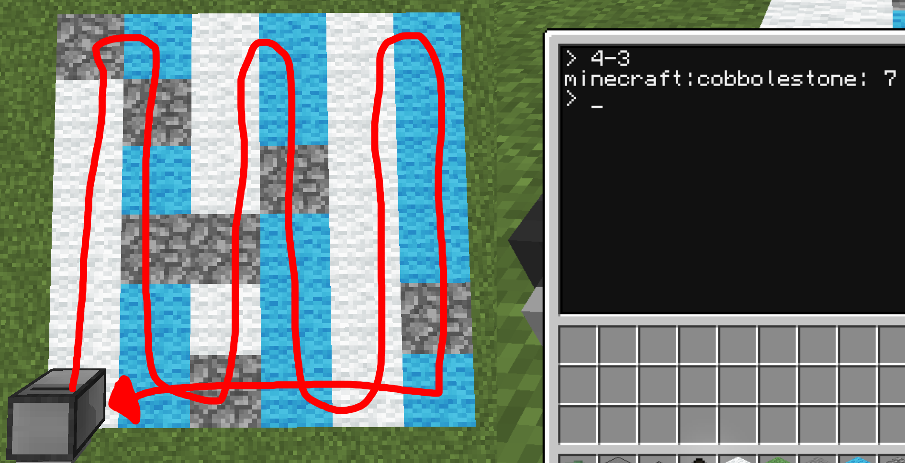

<!-- $theme: gaia -->


## `創好リナ`の
# ==Programming Seminar==
### 4bit 
# Loop
##### 2018.08.26

---

# 繰り返しの処理
- 配列 (Array)
- 連想配列 (Map)
- ループ処理とは
- while文
- for文

---

# ==Array==

---

# ==配列==
- 連続した変数を一つにまとめたもの
- 一つ一つの中身を`要素(Element)`と呼ぶ
- 要素には1から番号が振られる(`添字(Index)`と呼ぶ)
- 要素は`配列名[添字]`で呼び出す
- `{1, 2, 3}`と宣言する


---

```lua
-- 配列の例

local array = {1, 5, 10, 50, 100}

type(array)  -- "table"

array[1]  -- 1
array[4]  -- 50

array[6] = 500
array[6]  -- 500

#array  -- 6 (長さ演算子)
```

---

# ==多次元配列==
- ==配列の配列==
- 普通の配列は1次元
- 4次元以上は多分アルゴリズム見直したほうがいい

```lua
local arr = {
  {1, 2, 3, 4},
  {5, 6, 7, 8},
  {9, 10, 11, 12},
  {13, 14, 15, 16},
}

arr[3][1]  -- 9
```

---

# ==Map==

---

# 連想配列
- 配列の添字を自由に名付けたもの
- 添字は`key`とか呼ばれる
- Luaではkeyの型は何でもOK
- `{[key] = element,}`で宣言
  - keyが予約語、演算子にかぶらない文字列なら<br>`{key = elemet,}`と書ける


---

```lua
--  連想配列の例

local map = {
  a = 1, b = 5, c = 10, ["d-e"] = 20, [true] = 100
}

type(map)  -- "table"  (LuaではArrayもMapも同じもの!)

map["a"] -- 1
map.b    -- 5  ([]無しで宣言できるものは.keyでアクセス可)
map[true] -- 100

map.z = 255
map["x"] = 0

#map  -- 7

```

---

# 繰り返しの処理とは


---

# 繰り返しの処理とは
- 同じような処理を繰り返す時はループを使おう
- 数百回とか自分で書くと地獄&バグの温床
- プログラミングしてるとめっちゃ使うよ!!!

---

# 

---

# ==while==文

--- 
# ==while==文
- 一番基本的なループ構文
- 条件式が真値の場合にループする
- 中の処理に入る前に評価される
```lua
while 条件式 do
  処理...
end
```

---


```lua
-- while 例

local i = 1
while i <= 100 do
  print(i)
  i = i + 1
end
```
- i が 100を超えたら終了するループ

---

# ==for==文

---

# ==for==文
- ループの基本的な構文
- **範囲が決まっている**系ループはforを使う
  - それ以外は全てwhileを使うのがBest
- Luaではforの書き方2つ

---

### 数値範囲で回すfor文
- 1~10などの数値範囲でループする

```lua
for var = Start, End[, Step] do
  ...
end
```
- Stepを定義するといくつ増やすか定義できる
  - デフォルトは+1
- whileで表すと
  - 入り切らないのでLua公式Document参照

---

```lua
-- for 例

for i = 1, 100 do
  print(i)
end
```
- i が 100を超えたら終了するループ

---

### ジェネリックfor文

- 配列を回したり自分の定義で回したい場合
```lua
for var1[, var2...] in factory() do
  ...
end
```
- 配列を回す場合`ipairs(配列)`
- 連想配列を回す場合`pairs(連想配列)`
- while文での書き方は公式Document

---

```lua
-- Generic for 例

local arr = {1, 5, 10, 50, 100, 500}

for i, v in ipairs(arr) do
  print("index: " .. i)
  print("element: " .. v)
end

local map = {a = 1, b = 10, c = 100, d = 1000}

for k, v in pairs(map) do
  print("key: " .. k)
  print("element: " .. v)
end
-- Mapのループ(pairs)は順番が担保されない

```

---

# ==Repert==文

---

# ==Repert==
- 条件式の評価がループない処理の後になる
  - =>==最初に1回は絶対実行される==
- それ以外はwhileと同じ
```lua
repeat
  ...
until
```

---

# ==break==

---

# ==break==
- ループを途中で脱出する
- Luaでは`end`の手前(ブロックの最後)のみ使える
- 複雑なループで条件によって抜けるとかに使う
- ==普通は使わない==
```lua
for i = 1, 10 do
    print("i: " .. i)
    if i == 5 then
        break
    end
end
-- 5までしか表示されない
```

---
## 多重ループ
- ループの中でループを回す事
- 4重以上は多分アルゴリズム見直したほうがいい
```lua
for i = 1, 10 do
  for j = 1, 10 do
    print(i, j)
  end
end
```

---

# 今回の内容は非常に頻繁に<br>使うのでしっかり理解しよう

---

# 以上

---

### 今回使用するCC関数
#### `turtle.inspect()` / `inspectUp()` / `inspectDown()`
- その方向のブロックID,メタデータを取得する
- Returns:`boolean success, table data`
- なにもない(air)場合success = false
```lua
data = {name = "ブロックID", metadata = 0}
```
```lua
local success, data = turtle.inspect()
if success then
  print("Block name: " .. data.name)
end
```

---

# 4bit目 問題

---
`4-1`
- 1 ~ 10までを表示して、合計を表示しなさい
```text
i: 1
i: 2
i: 3
i: 4
i: 5
i: 6
i: 7
i: 8
i: 9
i: 10
sum: 55
```

---

`4-2`
- タートルを壁に当たるまで数えて進ませて、<br>壁にあたったら`oups >_<`と表示して終了しなさい


---

`4-3`
- タートルを6x6の範囲でジグザグに動かし、戻ってくるプログラムを書きなさい
- ただし、全てのマスで真下のブロックを`inspect`したデータを配列に保持して最後に丸石の数を数えて表示しなさい


